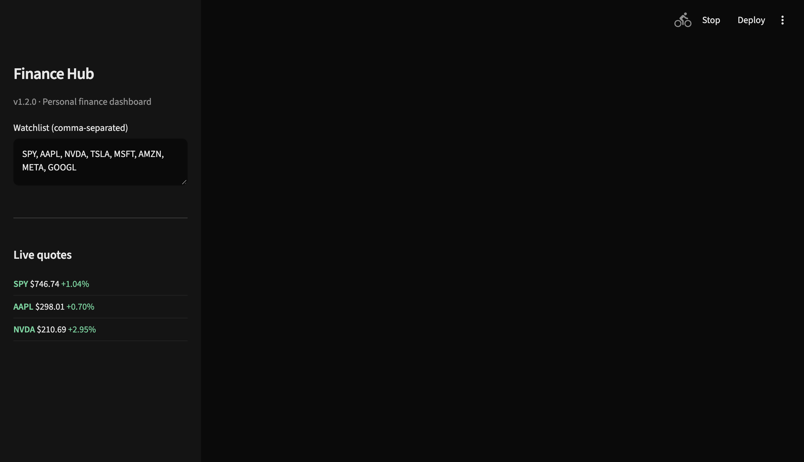
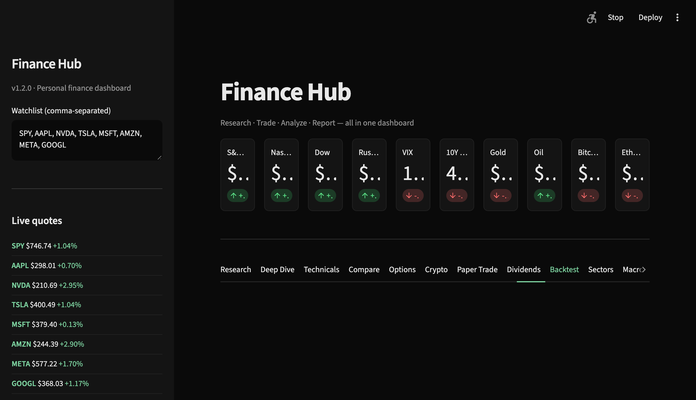
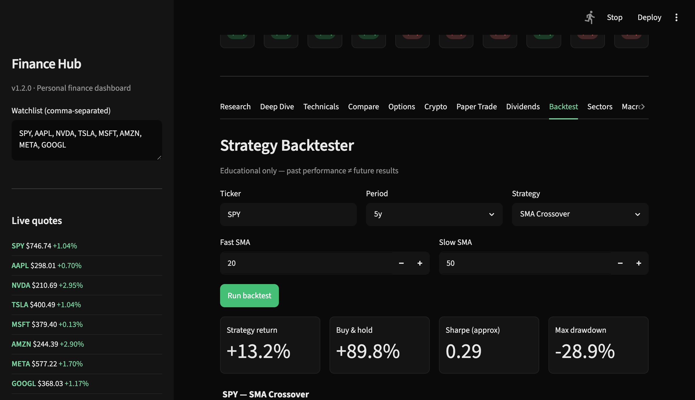

# Finance Hub

Personal finance dashboard I built in Python. Stock screener, charts, paper trading, backtests — runs locally on your machine. Uses Yahoo Finance for market data.

**Pricing: free.** Open source on GitHub. No subscription, no paywall, no Gumroad.

[](https://github.com/Haydenjstump/finance-hub/actions/workflows/ci.yml)


**[Live demo page](https://haydenjstump.github.io/finance-hub/)** · **[Source](https://github.com/Haydenjstump/finance-hub)**

## Screenshots

| Market tape + screener | Black-Scholes Greeks | Strategy backtest |
|---|---|---|
|  |  |  |

## Features

| Module | What it does |
|--------|--------------|
| **Market Overview** | Live tape — SPY, QQQ, VIX, BTC, yields |
| **Research** | Stock screener (12 filters), watchlist filter, earnings calendar |
| **Deep Dive** | Fundamentals, analyst ratings, financials, holders |
| **Technicals** | Daily + intraday charts, RSI, MACD, Bollinger Bands |
| **Compare** | Multi-ticker overlay + correlation matrix |
| **Options** | P/L calculator, Black-Scholes Greeks, IV chain |
| **Crypto** | BTC/ETH/SOL charts, screener, compare |
| **Paper Trading** | $100k virtual portfolio with trade history |
| **Dividends** | Yield screener + payment history |
| **Backtest** | SMA crossover & RSI strategies |
| **Sectors** | Sector ETF performance heatmap |
| **Macro & News** | Fed calendar, indicators, news + sentiment |
| **Portfolio** | Track holdings, sector allocation, correlation |
| **Reports** | Export PDF reports |
| **Alerts** | Price alerts in sidebar |

## Quick Start

```bash
git clone https://github.com/Haydenjstump/finance-hub.git
cd finance-hub
./install.sh
./run.sh
```

Or if you already have the folder:

```bash
./install.sh   # one time
./run.sh       # launch
```

Opens at **http://localhost:8501**

If port 8501 is already in use, the app is probably already running — open that URL. Otherwise `./run.sh` will tell you how to use port 8502.

## Requirements

- macOS, Linux, or Windows
- Python 3.11 or newer
- Internet connection (live market data via Yahoo Finance)

## Manual Install

```bash
python3 -m venv .venv
source .venv/bin/activate   # Windows: .venv\Scripts\activate
pip install -r requirements.txt
streamlit run app.py
```

## Verify Install

```bash
.venv/bin/python scripts/smoke_test.py
```

Full pre-release checks (optional — needs network, skips localhost URLs):

```bash
.venv/bin/python scripts/diagnostics.py
```

## Tech Stack

- **Python 3.11+** · **Streamlit** UI · **Plotly** charts
- **yfinance** for market data · **pandas/numpy** for analysis
- **Black-Scholes** Greeks in `lib/greeks.py` (from scratch, no QuantLib)

## Data & Privacy

- Market data fetched from **Yahoo Finance** (free, no API key)
- News headlines from public **RSS feeds**
- Portfolio, paper trades, and alerts saved **locally** on your machine
- **Not financial advice** — for research and education only

## File Structure

```
finance-hub/
├── app.py              # Main dashboard
├── install.sh          # One-command setup
├── run.sh              # One-command launch
├── lib/                # Feature modules
├── docs/images/        # README screenshots
├── scripts/            # Smoke test + packaging
└── .streamlit/         # Dark theme config
```

## Troubleshooting

| Problem | Fix |
|---------|-----|
| `command not found: python3` | Install Python from python.org |
| Charts empty | Check internet; try a different ticker |
| `ModuleNotFoundError` | Run `./install.sh` again |
| Port 8501 in use | Open http://localhost:8501 (already running) or `streamlit run app.py --server.port 8502` |

## License

MIT — use, modify, and redistribute freely with attribution. See [LICENSE](LICENSE).

## Support

haydenjstump@gmail.com